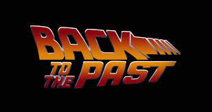

# VHS Rental shop - Blast from the past

We are creating a cutting edge VHS rental application management system for our special clients that value the old time retro VHS experience. 

### VHS Rental Application

#### API
1. Implement a VHS resource RESTful API over http. 
Path to this resource should be: /api/vhs
3. Implement CRUD RESTful API for Rental resource. 
Path to this resource should be: /api/rental
#### Model
- Model VHS 
- Model User 
- Model Rental 
#### Requirements
- RentalController should accept needed user ID data, vhs ID data, and rental date(use form or PATH parameters) 
- Make sure that the same vhs can't have multiple rentals on the same date
- handle rental due dates and late fees
- 4 HTTP methods should be implemented. (e.g. GET, POST, PUT and DELETE)
- Use Repository pattern
- Divide service layer from controller and repositories. 
- Externalize configuration.
- Use validation on RentalForm to validate requests to RentalController
- Customize error messages from REST controller with Message Source
- Prepopulate database of choice (H2, Postgresql or any other non-Oracle database)
- Create automated tests 

#### API&Security 

- Write API specification for all controller endpoints you have in your application by using swagger lib
- Implement security model with two existing roles. ROLE_ADMIN, ROLE_USER 
- Add ROLE_ADMIN to all rental shop workers in the system, and ROLE_USER to all existing rental shop clients in the system
- Implement login/logout and use with User and Workers credentials
- Forbid users with ROLE_USER access to RentalController resources

#### Postman collection
Design a simple postman collection to our VHS rental shop that will have these mandatory actions:
- Login/Logout
- VHS
  - List
  - VHS Rent and Return option
- List of Rentals

#### Run Nexus 
1) Write a Containerfile (Dockerfile) that containerizes the Nexus server. The binaries for Nexus server can be downloaded from the following URL: https://download.sonatype.com/nexus/3/nexus-3.37.3-02-unix.tar.gz. The Containerfile must also:
   - Use a base image of ubi8/ubi:8.3 and set an arbitrary maintainer.
   - Install the java-1.8.0-openjdk-devel package.
   - Define NEXUS_HOME environment variable to /opt/nexus
   - Unpack downloaded Nexus bundle into NEXUS_HOME folder
   - Define exposed ports
   - Define default working directory to NEXUS_HOME
   - Define a volume mount point for the /opt/nexus/sonatype-work container directory
   - Define the command for starting Nexus server
   - Use all other best practices and security consideration you are aware of
2) Write a podman or docker command that builds container image from the written Nexus Dockerfile.
3) Write a podman or docker command that starts the container from the builded Nexus image and:
   - Sets the container name to nexus
   - Runs the container in background
   - Mounts the container folder /opt/nexus/sonatype-work to host filesystem folder of your choosing
   - Binds host port 18081 to the exposed port in container
   - Starts the container automatically when operating system

#### Containerize your solution
1) Write a Containerfile (Dockerfile) that containerizes your solution. 
   - Use a base image of ubi8/ubi:8.3 and set an arbitrary maintainer.
   - Define exposed ports
   - Define the command for starting your solution
   - Use all other best practices and security consideration you are aware of
2) Write a podman or docker command that builds your container image from the written Dockerfile.
3) Write a podman or docker command that pushes the build container image to your previously run Nexus

# Guidance:

### Setup your account and repository
1. Setup GitHub account
2. Checkout repository with assignment
3. Fork your own repository
4. Create your own branch
5. Add your mentor as member to your repository with role Maintainer

### Tech stack

This version of the VHS Lab is more oriented around DevOps and as such is technology-agnostic.
The candidate can use any language/framework to implement his or her solution. 
All functional and non-functional requirements defined above need to be satisfied. In case you want to use Java and Spring follow the guidance provided in https://github.com/true-north-engineering/vhs-lab.git
